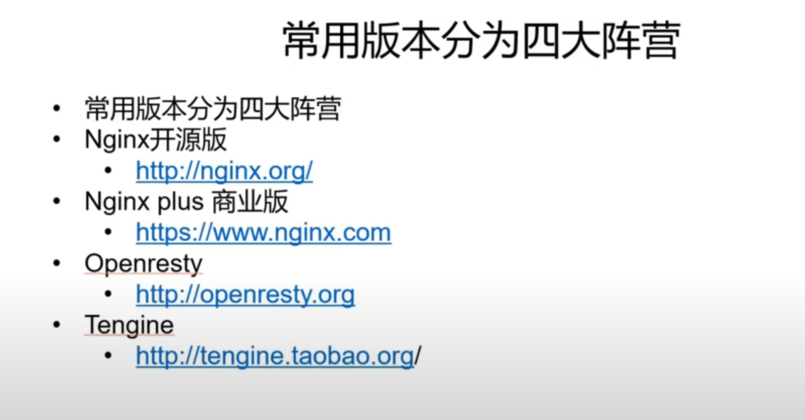
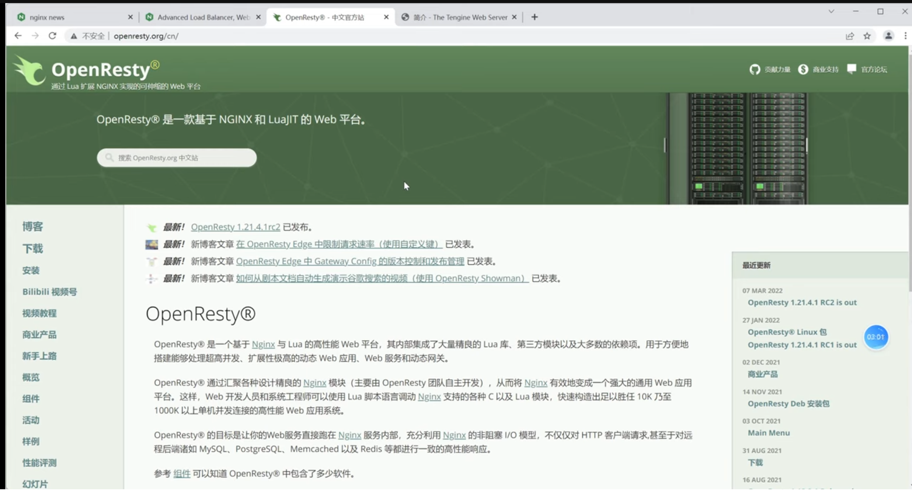
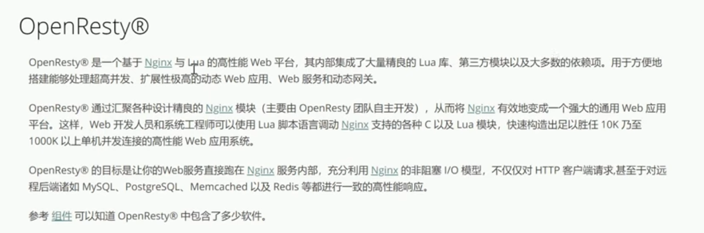
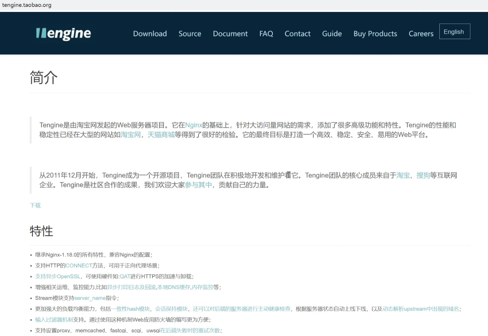
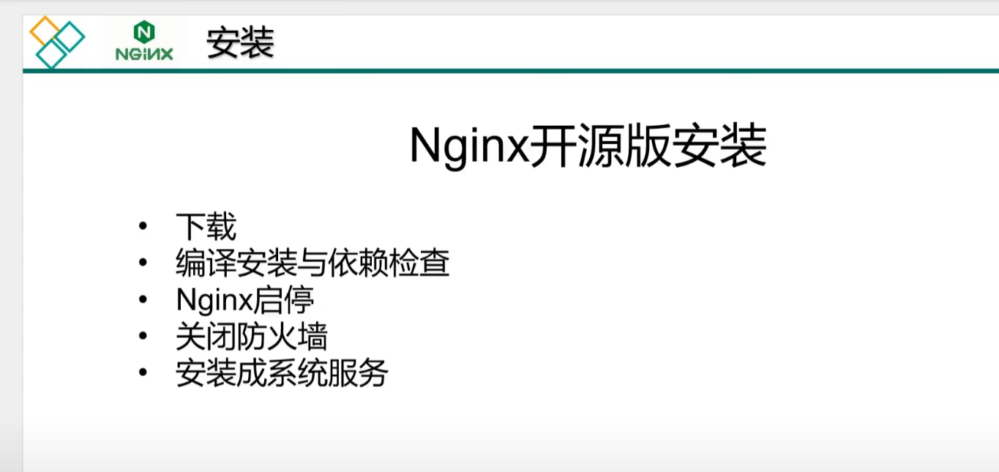

# 【Nginx】【核心技术篇】

## 01 Nginx从入门到精通 教程简介

[【Nginx】【核心技术篇】01 Nginx从入门到精通 教程简介 (youtube.com)](https://www.youtube.com/watch?v=04UBWn7zMWY&list=PLmOn9nNkQxJFKkgL4kqBtbX3J2FHmq8Ib)

## 06 安装部署 Nginx四个发型版本简单介绍

[【Nginx】【核心技术篇】06 安装部署 Nginx四个发型版本简单介绍 (youtube.com)](https://www.youtube.com/watch?v=aBlvabFgEaA&list=PLmOn9nNkQxJFKkgL4kqBtbX3J2FHmq8Ib&index=6)

Nginx Plus是F5厂商做的

